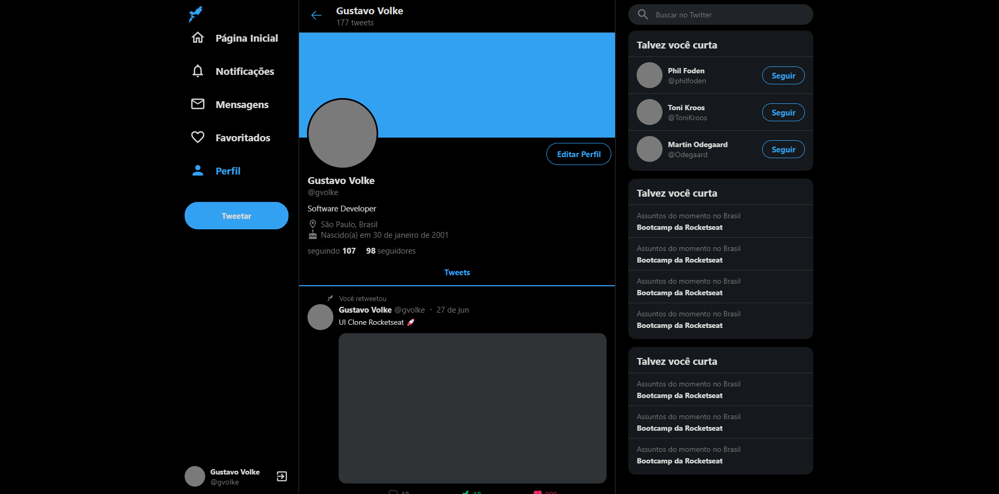

<h1 align="center"> UI Clone Twitter</h1>

<p align="center">
  <a href="#tecnologias">Tecnologias</a>&nbsp;&nbsp;&nbsp;|&nbsp;&nbsp;&nbsp;
  <a href="#projeto">Projeto</a>&nbsp;&nbsp;&nbsp;|&nbsp;&nbsp;&nbsp;
  <a href="#executar">Como Executar</a>&nbsp;&nbsp;&nbsp;|&nbsp;&nbsp;&nbsp;
  <a href="#imagens">Imagens</a>&nbsp;&nbsp;&nbsp;
</p>

<br>

# Tecnologias

Esse projeto foi desenvolvido com as seguintes tecnologias:

- React JS
- Typescript
- Styled Components
- Git e Github

# Projeto

Projeto desenvolvido para estudo de interfaces de usuário em um site de uma rede social. Neste trabalho, utilizei como referência o layout do Twitter, recriando a página de perfil dessa rede social, com a sidebar e o menu lateral. Também foram utilizados conceitos para responsividade em diversas telas.

# Executar

```bash
  # Instalar as dependências:
  $ yarn

  # Iniciar a aplicação:
  $ yarn start
```

# Imagens

<div style="display: flex; flex-direction: column; align-items: center;">
  
</div>
